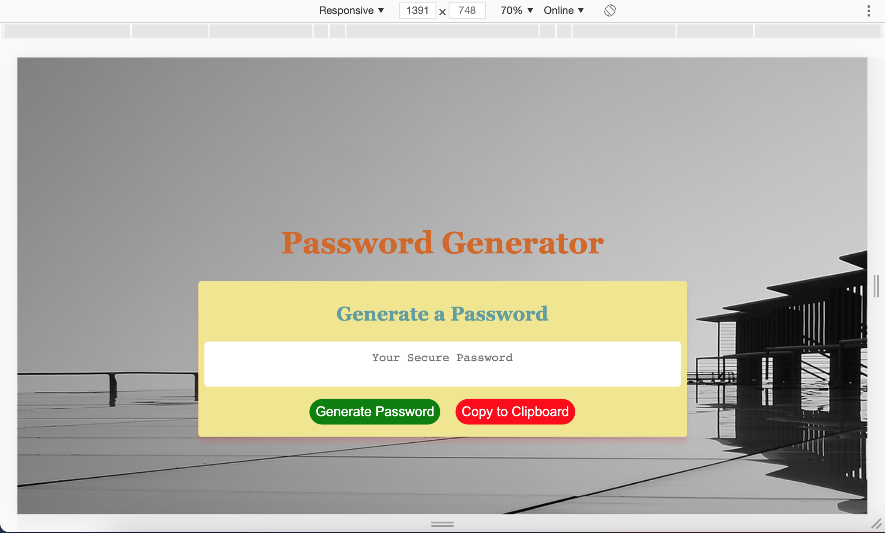
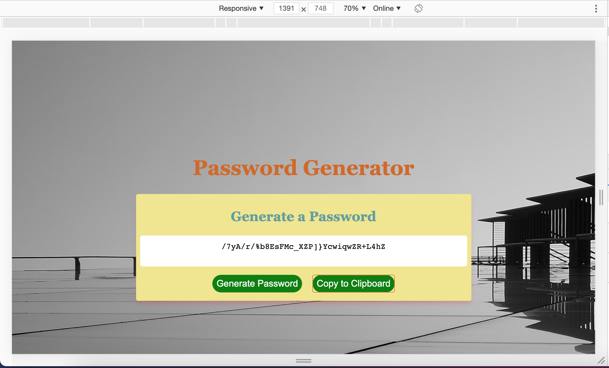
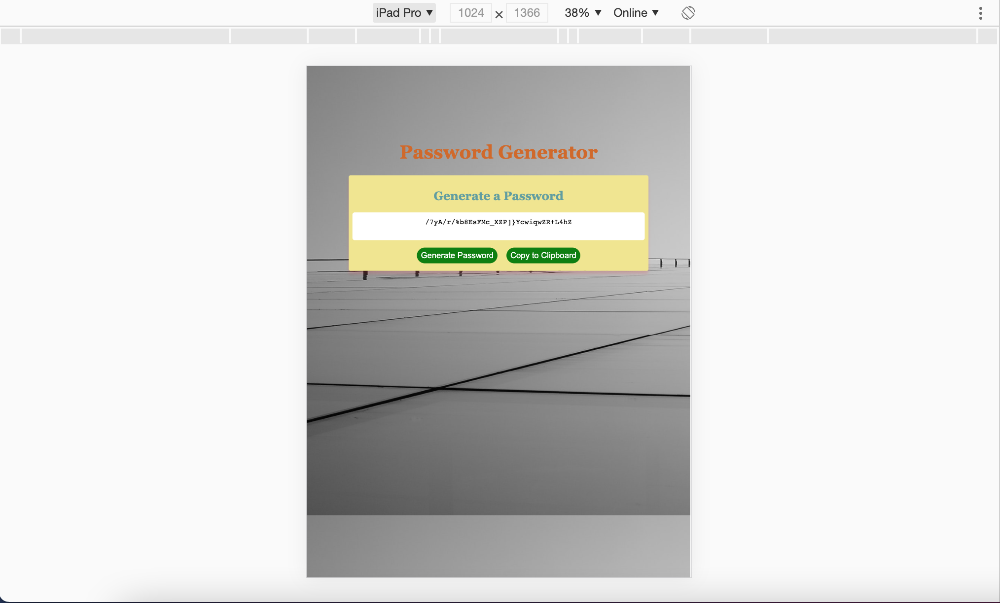
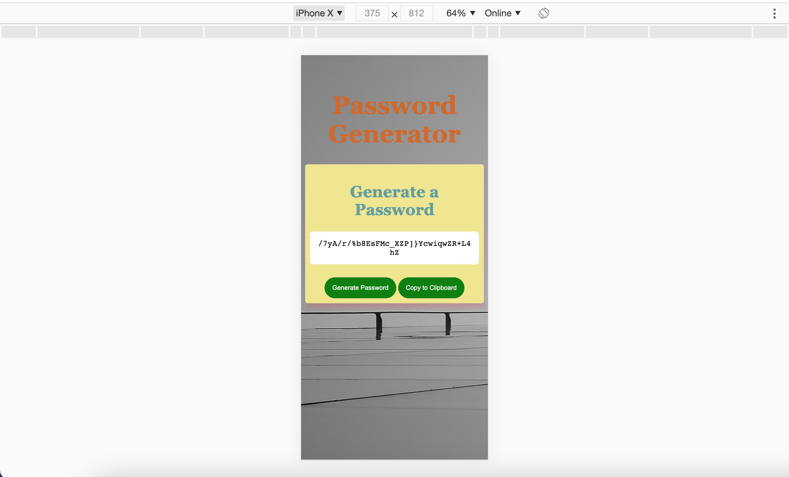

## 03 JavaScript: Password Generator

### Description of project
The aplication generates a random password based on user-selected criteria, via prompts, and provides a strong password for greater security. 

### Application description:
User are given couple options to select the password criteria, the user should choose the length of the password from the recommended range and at least one type of characters:
* Length range 8-128 characters
* List of characters type: lower case,  upper case, numeric and  special characters.

The Copy to Clipboard button is deactivated until we generate a password. 

After the password is generated, user can easy copy the password using the button Copy to Clipboard.

### Application is responsive: 

### Credits:
* https://www.w3schools.com/js/js_random.asp
* https://www.w3schools.com/js/js_math.asp
* https://www.w3schools.com/js/js_array_method
* https://www.w3schools.com/js/js_random.asp
* https://www.w3schools.com/css/css_boxmodel.asp

### Contributors:

*  corobcenco.sandu@gmail.com
* [Sandu Corobcenco](https://github.com/SanduCorobcenco)
### Directory:
* [Current Repository](https://github.com/SanduCorobcenco/H3_Password_Generator)
* [Website](https://sanducorobcenco.github.io/H3_Password_Generator/)
